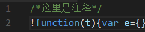

# webpack-add-annotation-plugin
#### 一个在webpack打包后的文件中添加注释的插件。


## 使用 🐛
1.下载包.
```sh

```
1.在webpack.config.js里面添加插件配置如下.
```JavaScript
plugins: [
    /*这里用到了我们的插件*/
    new WebpackAddAnnotationPlugin({
      startText: "/*这里是注释*/",/*要添加的注释*/
      startNewLine: true, /*注释和文本是否换行*/
      test:/^.*\.js$/gi, /*正则匹配 默认全部匹配 这里给所有js结尾的加注释*/
    })
  ],
```

## 例子

1. 克隆项目：
`git@github.com:KaiOrange/webpack-add-annotation-plugin.git`
2. 下载包：
`npm install`
3. 运行测试例子：
`npm run test`
4. 运行完成后查看dist目录下的文件，如下注释已经加载上了。
